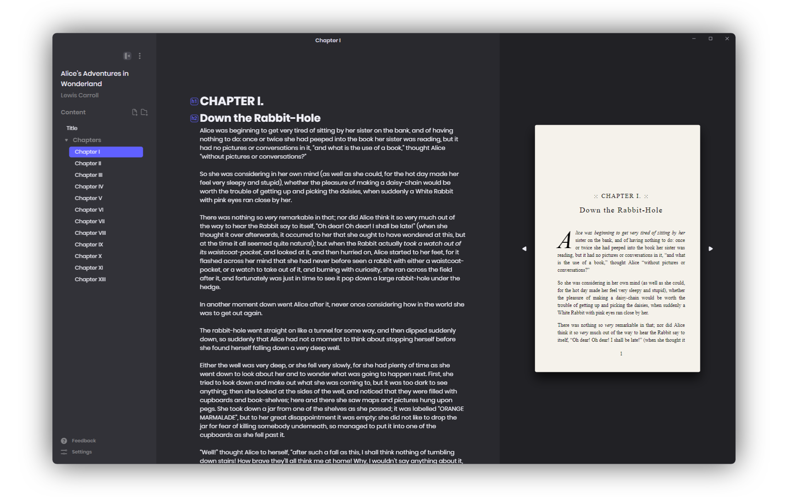

<div align="center">

  
  <h1>Calamus</h1>
  
  <p>
    Write and Publish Novels With Ease
  </p>
    
  [](https://github.com/midnightprioriem/calamus/actions/workflows/build-and-test.yml)
  [](https://github.com/midnightprioriem/calamus/actions/workflows/release.yml)
  <a href="https://github.com/midnightprioriem/calamus/releases"></a>
  <a href="https://github.com/midnightprioriem/calamus/releases"></a>

  
  
</div>
  


<br />

<!-- About the Project -->
## :star2: About the Project

Calamus is a React Electron application for writing and publishing novels.

<!-- Features -->
### :dart: Features

Calamus is currently still in pre-alpha stages---not all features are available. For a feature roadmap, please visit our <a href="https://github.com/midnightprioriem/calamus/projects/2" target="_blank">Project Board</a>.

#### 🖊️ Write Your Next Novel

Calamus has what you need to organize and write your next novel. Organize your project into folders and use Markdown to make writing a breeze.

#### 👐 Open Format

Calamus stores all of your project data in a human readable json format. In addition, all book content is written using Markdown, making all of your work truly portable. You can export all of your book's content into markdown files at any time.

##### .cala Format

<details>

Calamus project files use the `.cala` file extension, but are really just `json` files (yes this means you can edit `.cala` files by hand, but it is not recommended!). See below for a table detailing the properties inside of a `.cala` file.

| Property Name | Description                                                                      |
|---------------|----------------------------------------------------------------------------------|
| bookTitle    	| The novel's title.                                                           	   |
| bookSubTitle 	| YThe novel's sub title. This is an optional property.                        	   |
| authorName   	| The novel's author name.                                                     	   |
| seriesName   	| The name of the series the novel is a part of. This is an optional property. 	   |
| ISBN         	| The novel's ISBN number.                                                     	   |
| language     	| The language the novel is written in.                                        	   |
| publisher    	| The name of the novel's publisher.                                           	   |
| content      	| Array containing the novel's content. See a table detailing the `Section` below. |

The content property contains a JSON array of the `Section` object type, detailed below.

| Property Name   | Description                                                                                                 |
|-----------------|-------------------------------------------------------------------------------------------------------------|
| id            	| The name of the section. Appears as the name in the project sidebar. **Must be unique**.    	              |
| content       	| Minified string of markdown content. Newlines are replaced with `\n` and `"` with `\"`.   	                |
| type          	| Section type. One of 4 values: `folder`, `maincontent`, `frontmatter`, `backmatter`.        	              |
| canHaveChildren | `true` or `false` value indicating whether the Section can have children. Only valid for `folder` sections.	|
| children      	| A JSON array of `Section[]`. Only valid for `folder` sections.                                             	|
| collapsed     	| `true` or `false` value indicating whether then section is collapsed. Only valid for `folder` sections.    	|


</details>


#### 📕 Print-ready PDF and EBook

Calamus is equipped to format your novel for Print and Ebook publication, with pre-made themes and endless customization.


<!-- Installation -->
## :gear: Installation

Download the [latest release here](https://github.com/midnightprioriem/calamus/releases).


## ⌨️ Contributing 

<details>

### 📜 Contribution Guidelines

TODO

<!-- Run Locally -->
### :running: Run Locally

Clone the project

```bash
  git clone https://github.com/midnightprioriem/calamus.git
```

Go to the project directory

```bash
  cd my-project
```

Install dependencies

```bash
  yarn install
```

Start the app

```bash
  yarn start
```

<!-- Running Tests -->
### :test_tube: Running Tests

To run tests, run the following command

```bash
  yarn test
```

</details>

<!-- Acknowledgments -->
## :gem: Acknowledgements

 - [⚡ Electron](https://www.electronjs.org/)
 - [⚛️ React](https://reactjs.org/)
 - [🏗️ Electron React Boilerplate](https://electron-react-boilerplate.js.org/)
 - [📝 Codemirror](https://codemirror.net/6/)
 - [💅 Styled Components](https://styled-components.com/)
 - [🐻 Zustand](https://github.com/pmndrs/zustand)
 - [📖 pagedjs](https://pagedjs.org/)
 - [🌳 Unified (rehype, remark)](https://unifiedjs.com/)
 - [👆 dnd kit](https://dndkit.com/)
