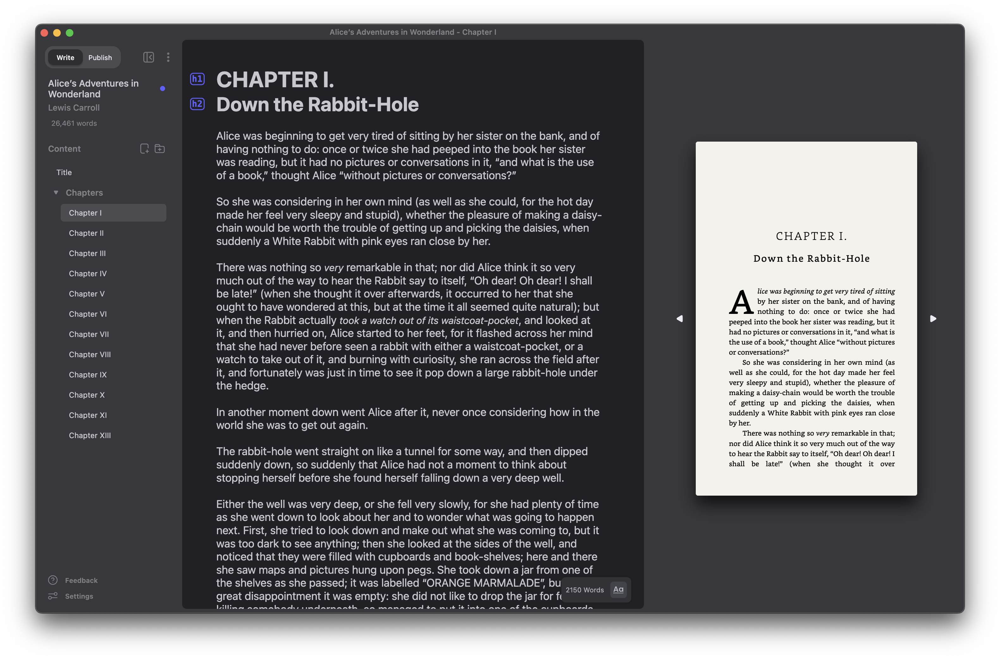

<div align="center">

  
  <h1>Orca</h1>
  
  <p>
    Write and Publish Novels With Ease
  </p>
    
  [](https://github.com/midnightprioriem/orca/actions/workflows/build-and-test.yml)
  [](https://github.com/midnightprioriem/orca/actions/workflows/release.yml)
  <a href="https://github.com/midnightprioriem/orca/releases"></a>
  <a href="https://github.com/midnightprioriem/orca/releases"></a>

  

  
</div>
  


<br />

<!-- About the Project -->
## :star2: About the Project

Orca (previously Calamus) is a React Electron application for writing and publishing novels.

<!-- Features -->
### :dart: Features

Orca is currently still in pre-alpha stages---not all features are available. For a feature roadmap, please visit our <a href="https://github.com/midnightprioriem/orca/projects/2" target="_blank">Project Board</a>.

- Open format project files (json)
- Markdown Editor
- LanguageTool Integration
- Customizable Interface
- Print-ready PDF export
- Custom print formatting

#### 🖊️ Write Your Next Novel

Orca has what you need to organize and write your next novel. Organize your project into folders and use Markdown to make writing a breeze.

#### 👐 Open Format

Orca stores all of your project data in a human readable json format. In addition, all book content is written using Markdown, making all of your work truly portable. You can export all of your book's content into markdown files at any time.

##### .orca Format

<details>

Orca project files use the `.orca` file extension, but are really just `json` files (yes this means you can edit `.orca` files by hand, but it is not recommended!). See below for a table detailing the properties inside of a `.orca` file.

| Property Name     | Description                                                                      |
|-------------------|----------------------------------------------------------------------------------|
| bookTitle         | The novel's title.                                                           	   |
| bookSubTitle 	    | YThe novel's sub title. This is an optional property.                        	   |
| authorName   	    | The novel's author name.                                                     	   |
| seriesName   	    | The name of the series the novel is a part of. This is an optional property. 	   |
| ISBN             	| The novel's ISBN number.                                                     	   |
| language         	| The language the novel is written in.                                        	   |
| publisher    	    | The name of the novel's publisher.                                           	   |
| content         	| Array containing the novel's content. See a table detailing the `Section` below. |
| publishSettings   | `PublishSettings` object. See a table detailing `PublishSettings` below.         |

The content property contains a JSON array of the `Section` object type, detailed below.

| Property Name   | Description                                                                                                 |
|-----------------|-------------------------------------------------------------------------------------------------------------|
| id            	| A uniquely generated identifier.                                                             	              |
| name           	| The section's name.                                                                         	              |
| content       	| Minified string of markdown content. Newlines are replaced with `\n` and `"` with `\"`.   	                |
| type          	| Section type. One of 4 values: `folder`, `maincontent`, `frontmatter`, `backmatter`.        	              |
| canHaveChildren | `true` or `false` value indicating whether the Section can have children. Only valid for `folder` sections.	|
| children      	| A JSON array of `Section[]`. Only valid for `folder` sections.                                             	|
| collapsed     	| `true` or `false` value indicating whether then section is collapsed. Only valid for `folder` sections.    	|
| depth         	| Depth of the section in the tree. Starts at 0.                                                            	|
| index         	| Index of section related to its children. Starts at 0.                                                     	|
| parentId       	| For child sections, this is equal to the id of the section's parent                                        	|

The `PublishSettings` object type contains the book's formatting settings for eBook and print PDF.

| Property Name                  | Description                                                                                    |
|--------------------------------|------------------------------------------------------------------------------------------------|
| dropCap            	           | Boolean value indicating whether or not to use a drop cap at the beginning of chapters.        |
| dropCapEnableAdvancedSettings  | Boolean value for enabling advanced drop cap settings.                        	                |
| dropCapFont       	           | An advanced drop cap setting for setting the drop cap to a different font.  	                  |
| dropCapLineHeight              | An advanced drop cap setting for adjusting the line height of the drop cap.   	                |
| dropCapBottomMargin            | An advanced drop cap setting for adjusting the bottom margin of the drop cap.              	  |
| leadIn      	                 | Lead in (first line of each chapter) type. Can be 'None', 'Small Caps', or 'Italics'          	|
| sceneBreak                     | A string that will be used for scene breaks. Replaces horizontal rules.                     	  |
| rectoPageHeaders               | Header for recto (odd) pages. Can be 'None', 'Chapter Title', 'Book Title', or 'Author Name'	  |
| versoPageHeaders               | Header for verso (even) pages. Can be 'None', 'Chapter Title', 'Book Title', or 'Author Name'  |
| paragraphFont                  | Font to use for paragraph text. Can be any font installed on system.                           |
| fontSize                       | Font size to use for paragraph text.                                                           |
| lineHeight                     | Paragraph line height. Can be 'Single', '1.5', or 'Double'.                                    |
| dropFolio                      | Boolean value indicating whether or not to add a drop folio to the first page of each chapter. |
| topMargin                      | Top margin of each page in inches.                                                             |
| bottomMargin                   | Bottom margin of each page in inches.                                                          |
| insideMargin                   | Inside margin of each page in inches.                                                          |
| outsideMargin                  | Outside margin of each page in inches.                                                         |
| trimSize                       | Trim size of the book. i.e., '5in x 8in'                                                       |

</details>


#### 📕 Print-ready PDF and EBook

Orca is equipped to format your novel for Print and Ebook publication, with pre-made themes and endless customization.

https://user-images.githubusercontent.com/6120081/172929343-21c5411f-2e3e-4b0d-9c42-8e9a98dee466.mp4

https://user-images.githubusercontent.com/6120081/172929360-425be8b4-3f57-43f6-9dd9-4e84905a99ae.mp4

<!-- Installation -->
## :gear: Installation

Download the [latest release here](https://github.com/midnightprioriem/orca/releases).


## ⌨️ Contributing 

<details>

### 📜 Contribution Guidelines

TODO

<!-- Run Locally -->
### :running: Run Locally

Clone the project

```bash
  git clone https://github.com/midnightprioriem/orca.git
```

Go to the project directory

```bash
  cd my-project
```

Install dependencies

```bash
  yarn install
```

Start the app

```bash
  yarn start
```

<!-- Running Tests -->
### :test_tube: Running Tests

To run tests, run the following command

```bash
  yarn test
```

</details>

<!-- Acknowledgments -->
## :gem: Acknowledgements

 - [⚡ Electron](https://www.electronjs.org/)
 - [⚛️ React](https://reactjs.org/)
 - [🏗️ Electron React Boilerplate](https://electron-react-boilerplate.js.org/)
 - [📝 Codemirror](https://codemirror.net/6/)
 - [💅 Styled Components](https://styled-components.com/)
 - [🐻 Zustand](https://github.com/pmndrs/zustand)
 - [📖 pagedjs](https://pagedjs.org/)
 - [🌳 Unified (rehype, remark)](https://unifiedjs.com/)
 - [👆 dnd kit](https://dndkit.com/)
